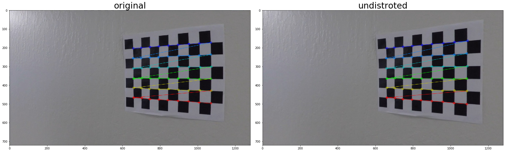
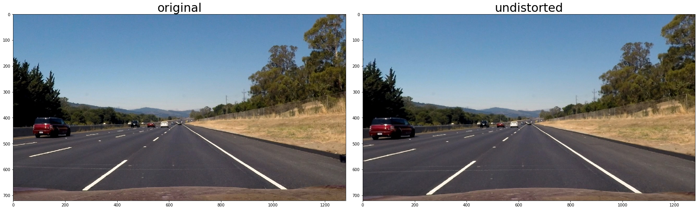
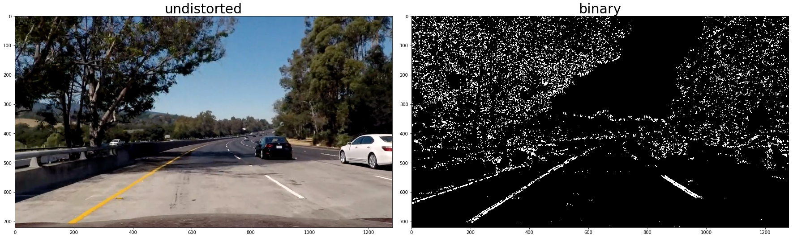
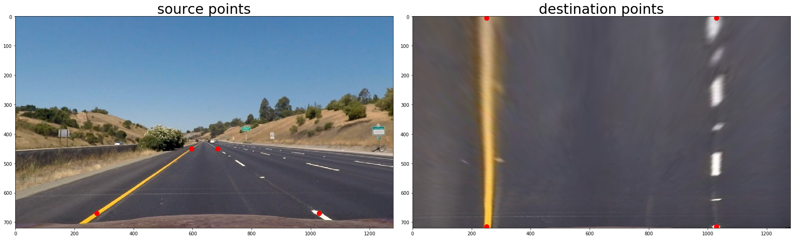
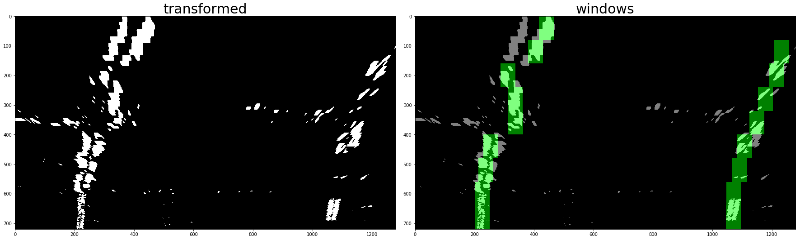
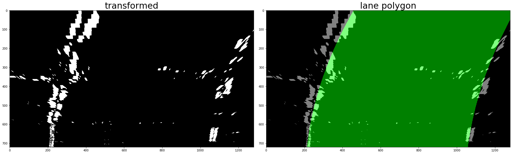
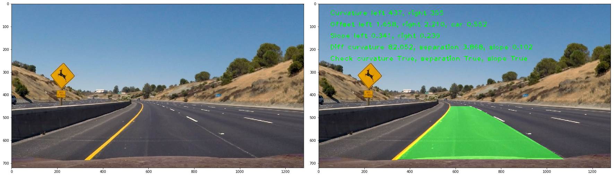
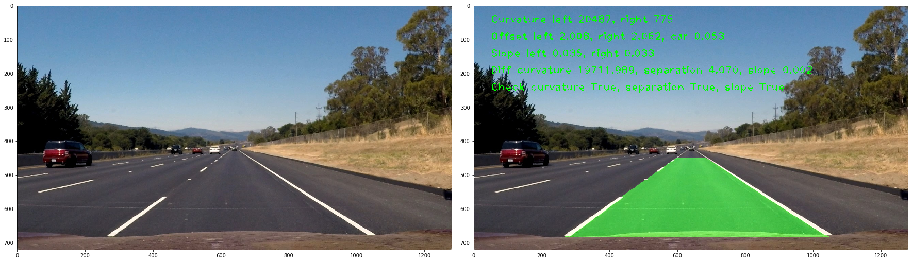
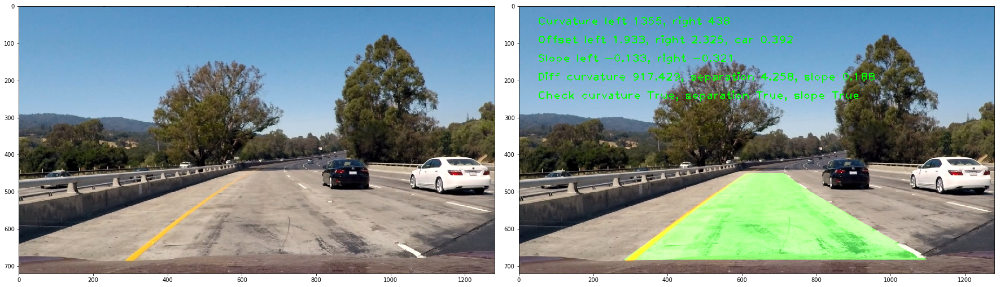
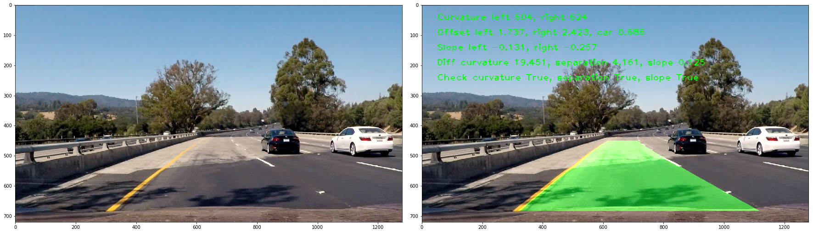

# Advanced Lane Finding

## Project goals

The goals / steps of this project are the following:

* Compute the camera calibration matrix and distortion coefficients given a set of chessboard images.
* Apply a distortion correction to raw images.
* Use color transforms, gradients, etc., to create a thresholded binary image.
* Apply a perspective transform to rectify binary image ("birds-eye view").
* Detect lane pixels and fit to find the lane boundary.
* Determine the curvature of the lane and vehicle position with respect to center.
* Warp the detected lane boundaries back onto the original image.
* Output visual display of the lane boundaries and numerical estimation of lane curvature and vehicle position.

## Project structure

The project is implemented in Jupyter notebook `advanced_lane_finding.py` included in the repository. Project steps are marked with appropriate subtitles and intermediate steps for all test images are visualized inside the notebook. This writeup will include sample images for each step for demonstration purposes.

## Camera calibration

Chesboard images are used to calibrate the camera. The calibration is accomplished by finding chessboard corners in the chessboard images with `cv2.findChessboardCorners()` and mapping them to the points on a plane. The `cv2.calibrateCamera()` takes this mapping and generates paramters to remove camera distortions with `cv2.undistort()`. Chessboard corners are visualizaed `cv2.drawChessboardCorners()`, along undistroted chessboard images.



Images above demonstrate the effect of camera calibration, e.g. right edge of the chessboard is straign in the undistorted image compared to slightly cruved in the original image. Detected corners are shown in the original image.

## Image pipeline

### Distortion-corrected image

Distortion correction was applied to all test images. Here I include one example of an undistrted test image.



It is noticable that thte car on the right slightly changed its proportions as the result of the correction.

### Create a thresholded binary image

The goal of this step is to create a binary image that includes lanes, eliminating all other details as much as possible, especially on the road part of the image. For this purpose I used sobel x operator that takes derivative in the x direction of the image. It is applied to the grayscale image and identifies edges (changing values) in x direction. In addition saturation threshold is used, identifying areas of image with high saturation. It works because the road has grayish colors and lanes have saturated colors to stand out. Finally, gradient direction thresholding is used to remove unrelevant parts of the image still remaining. It was added when experimenting with the challenge video to eliminate the edge where parts of the road with different tones meet. These threshold were combined as follows:

```
(sobel_x or saturation) and gardient_direction
```



As can be seen in the image above, thresholding eliminates most of the details on the road that are not lanes.

### Perspective transform

Perspective transform is accomplished using `cv2.warpPerspective()`, which finds a matrix that transfroms destination points to source points. These points were determined based on one of the test images with straight lanes, overlaying them on the image and then tweaking them until these points match the lanes.



Images above show overlayed source and destination points.

### Identifing lane-line pixels and fitting them with a polynomial

Lane-line pixels were identified by splitting the image into horisontal layers and scanning them with the 50x80 pixel window to find the maximal x value after applying a convolution. To identify start of the left lane, the left half of the image is scanned; for the right lane the right half. Consequent layers are scanned only within the margin of 100 pixels, to ensure continuity of the lanes.



The image above shows identified windows with the green overlay. Window points were then fitted with second degree polynomial using `np.polyfit()`.



The image above visualizes the fit as a polygon.

### Radius of curvature and car offset

Curvature is calculated by the `get_curvature()`, given the lane fit and y position to calculate the curvature at. It is called from the `update()` method in the `Lane` class. To get the curvature in meters instead of pixels, points are multiplied by the `m_per_px` constant. Offset for the car is calculated as difference in distances from the middle of the image to left and right lanes, multiplied with `m_per_px` to get the values in meters. The code for offsets is part of the `update()` method in the `Lane` class and `process()` method of the `LaneFinder` class, which contains the video pipeline.



The image above contains an overlay with pronted curvature and offsets. The first row are the curvatures for left and right lanes. The second row are offsets for left, right lanes and the car. Third row are the slopes of the lanes. The fourth row shows the difference between lanes in terms of curvature, separation and slopes. The bottom row shows whether these differences are within boundaries, used as a sanity check.

### Plotting the lane area

Lane area is plotted as a polygon in the `draw_lanes_poly()` function in the 'Video pipeline' cell of the notebook. Examples of test images:





## Video pipeline

Video pipeline is implemented in the `LaneFinder` class. In addition to the image pipeline it includes methods to improve lane recognition across frames such as looking for lane points close to the points in the previous frame, implemented in `find_close_points()`, sanity checks in `process()` method of the `LaneFinder` class and averaging across the last 5 frames in `smooth_fit()` method of the `Lane` class. Here is the project video with marked lane area and curvature, offset parameters overlay.

Here's a [the output for the project video](./output_videos/project_video.mp4)

## Discussion

Although my pipeline works reasonably well on the project video, it doesn't perform so well on the challenge videos. The edge in the middle of the road confuses the pipeline, resulting in false points detected as part of the lane. The solution will be to introduce color thresholding (white and yellow) and include the separation parameter in the detection of lanes, e.g. ignore lane-like line if it is too close to another lane. Here is the [output for the challenge video](./output_videos/challenge_video.mp4)

The pipeline fails for the harder challenge video, where the turns are very steep and the right lane is on the edge of the road. A possible solution will be to detect the road area rather than just the lanes. Here is the [output for the [output for the harder challenge video](./output_videos/harder_challenge_video.mp4)
